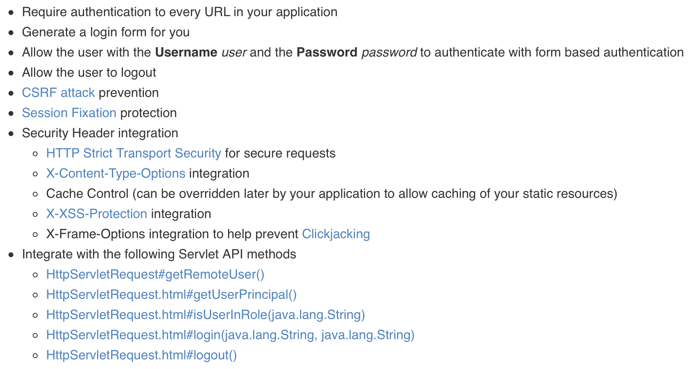

# 🐳 JIKGORAE-Project-records
#### 본 저장소의 목적은 [우아한테크코스 팀 프로젝트](https://github.com/woowacourse-teams) 를 진행하면서 했던 내용들을 정리하는 것입니다.  

## 직고래 
당신이 속한 그룹 어디든 당신이 원하는 것을 사고 파세요. 조직 중고 거래, 직고래 🐳

> 따뜻한 교류가 있는 조직 벼룩시장을 꿈꾸다

- [직고래 Github](https://github.com/woowacourse-teams/2020-seller-lee-company)
- [직고래 소개](https://sites.google.com/woowahan.com/wooteco-demo/직고래/)

## 기술 스택


## 패키지 구조
```gherkin
api
  ├── article
  │   ├── application
  │   ├── domain
  │   ├── presentation
  │   └── query
  ├── articleFavoriteCount
  │   ├── application
  │   └── domain
  ├── articleOrganization
  │   ├── application
  │   └── domain
  ├── chatroom
  │   ├── application
  │   ├── domain
  │   ├── presentation
  │   └── query
  ├── common
  │   └── config
  ├── evaluation
  │   ├── application
  │   ├── domain
  │   └── presentation
  ├── favorite
  │   ├── application
  │   ├── domain
  │   └── presentation
  ├── member
  │   ├── application
  │   ├── domain
  │   └── presentation
  ├── memberOrganization
  │   ├── application
  │   ├── domain
  │   └── presentation
  ├── organization
  │   ├── application
  │   ├── domain
  │   ├── presentation
  │   └── query
  ├── security
  │   ├── config
  │   ├── core
  │   ├── filter
  │   ├── handler
  │   ├── oauth2
  │   │   ├── authentication
  │   │   ├── provider
  │   │   └── service
  │   └── web
  └── trade
      ├── application
      ├── domain
      └── presentation
```
```gherkin
chat
  ├── config
  ├── message
  │   ├── application
  │   ├── domain
  │   └── presentation
  └── wholeMessage
      ├── application
      ├── domain
      └── presentation
```

## Level 3

### 도메인 설계
첫 도메인 설계 때 많은 회의를 하였습니다. 그중 가장 화두가 됐던 것은 **DDD 패턴을 적용할까?** 입니다.
기술 스택 스펙트럼을 너무 넓게 잡은 우리 팀은 DDD 패턴을 알고 있는 크루가 많이 없었기 때문에 걱정하였습니다.
DDD 패턴을 사용하지 않는다면 패키지 분리가 되어있지 않아 도메인 간의 aggregate를 파악하기 쉽지 않습니다.
그렇기 때문에 Aggregate 내부의 Entity나 VO에 접근할 때 주체가 되는 Aggregate Root을 참조하지 않고 접근해 데이터의 무결성이 깨질 수 있는 가능성이 있습니다.
DDD 패턴을 적용해 생명주기가 같은 변경단위별로 패키지를 분리해 구조를 파악하기 쉽게 하고 애플리케이션 또는 그 안의 모듈 간의 의존성은 최소화하고, 응집성은 최대화
할 수 있도록 설계하였습니다.

우리 팀이 도메인 설계를 하면서 주로 했던 고민입니다.
- Spring data 쓰다 보면 Aggregate 개념을 적용하게 됩니다. ([참고](https://www.slideshare.net/HyeonSeokChoi/ddd-repository)) 그래서 변경단위를 어떻게 가져가야 할 것인가에 대한 고민이 있었다.
- DDD의 핵심 목표 중 하나인 "Loosely coupling" 은 복잡한 연관 관계가 적용되면 연관된 객체에 대해 변경의 일관성을 유지하기 힘듭니다. 따라서 객체 참조보다
Id 참조를 함으로써 연관 관계를 없애 일관성을 더 쉽게 유지할 수 있습니다. <br/>
JPA를 학습하고 적용해보고 싶었던 우리는 DDD 에 맞게 단순히 id 참조를 하는 Spring data JDBC를 와 Spring data JPA 중 결정해야 했습니다.
- 단방향 참조를 하다 보니 참조를 통해 생긴 foreign key constrain 문제들 중 cascade 같은 문제들을 어떻게 해결하느냐는 고민이 있었습니다.

해당 고민에 대해 이렇게 해결하였습니다.
- DDD 의 Aggregate 개념을 적용해 패키지를 구조화하였습니다.
그런데 Aggregate 하는 변경단위라는 것이 누가 어떻게 생각하는 거에 따라 다른 것 같아서 많은 논쟁이 있었고 이 구조에 대해서는 계속 바뀔 수 있을 것 같습니다.
- JPA를 학습하고 싶은 욕구가 많았기 때문에 객체 참조를 하는 JPA를 쓰되 하나의 Aggregate에 하나의 Repository를 만들어 관리하였습니다.
- 양방향을 통해 mapped By 로 해결하던가 단방향 cascade 옵션을 걸어주는 방식이 해결하기로 했습니다.

- 참고
    - [Domain-Driven Design and MVC Architectures](https://blog.fedecarg.com/2009/03/11/domain-driven-design-and-mvc-architectures/)
    - [카카오헤어샵의 DDD](https://brunch.co.kr/@cg4jins/7) 
    - [DDD 핵심만 빠르게](https://happycloud-lee.tistory.com/94)
    - [DDD, Aggregate](https://medium.com/@chanhyeonglee/ddd-aggregate-애그리거트-98d9c1313c23)
    - [애그리게잇 하나에 리파지토리 하나](https://medium.com/@SlackBeck/애그리게잇-하나에-리파지토리-하나-f97a69662f63)
    
### 첫번째 클레스 다이어그램
 

### 프로젝트에서 맡은 주된 업무
#### Front
- React Native, Expo, TypeScript, Recoil, Axios
    - 프론트는 팀원 모두 학습하며 진행해야 했기 때문에 이슈를 골고루 가져갔습니다.
#### Back
- Spring Securtiy(OAuth2), Nginx, Https, Logback

프로젝트에서 혼자서 맡게 된 기술들입니다. 새로운 기술을 적용하면서 공부했던 방법과 내용, 고민들을 공유하겠습니다.

### Spring Securtiy(OAuth2 적용기)
#### 왜 Spring Securtiy 인가?
우선 시큐리티를 적용하기 전에 Form 형식의 회원가입을 통해 Member를 생성하였습니다.
하지만 '실제 운영해야 할 서비스이기 때문에 개인정보에 대한 보안에 신경 써야 하지 않을까?'라고 생각했고 보안 수준을 높일 방법이 뭐가 있을까 생각을 하였을 때
간단하지만 강력하게 구현 할 수 있는 이미 높은 보안 수준을 구축해둔 Spring Security를 사용하기로 선택했습니다.
Spring Security는 강력하면서도 쉽습니다. 게다가 단 몇십 줄의 코드만으로도 대형 웹서비스 사와 비슷한 수준의 보안을 유지할 수 있다는 장점이 있습니다.
Spring Security는 스프링 기반의 애플리케이션에서 보안을 위해 **인증**과 **권한 부여**를 사용하여 **접근을 제어**하는 프레임워크입니다. 또 커스터마이징이 가능합니다.

#### Spring Security가 제공하는 기능들

다양한 기능들이 있습니다. 만약 Spring Security를 적용하지 않는다면 위의 기능들 중 필요한 부분을 모두 손수 다 구현해야 한다는 것입니다.

**그러니 안 쓸 이유가 없겠죠?**

또 Security에서 OAuth2 설정을 제공합니다. 직접 RestTemplate이나 WebClient로 OAuth를 제공하는 서비스에 API 요청을 과 Redirect를 구현해 쓸 수 있지만
그 모든 게 구현이 되어있기 때문에 Sprring Security 를 사용해 카카오 OAuth 를 이용하도록 변경하였습니다.

하지만 이에 따른 대가가 있는데 너무 높은 추상화 수준 때문에 역추적이 쉽지가 않고 직접 디버깅을 하면서 따라가지 않으면 그 흐름을 파악하기 어렵다는 것입니다. 😭
그래서 먼저 기본적인 Spring Security [아키텍처](https://spring.io/guides/topicals/spring-security-architecture) 에 대해 알고 가야 한다고 생각하였고 학습 후 디버깅을 해보며 따라갔을 때 더 빠르게 흡수 할 수 있었습니다.

- 참고
    - [Spring Security 스프링 시큐리티](https://sieunlim.tistory.com/19)
    - [Spring Security Docs](https://docs.spring.io/spring-security/site/docs/5.1.5.RELEASE/reference/htmlsingle/#hello-web-security-java-configuration)

#### Spring Security의 구동원리, 아키택처


#### Filter 기반의 Spring Security(JwtAuthenticationToken)
Spring Security는 Filter 기반으로 이루어져 있습니다. 즉, Web Application에서 처리합니다. 즉 application context에서 처리됩니다. 따라서 web·xml에 등록하고 사용해야 합니다. 우리는 시큐리티의 간단한 설정으로 등록합니다.

이렇게 Filter를 기반으로 한 이유로는 프레임워크 의존성을 없애기 위함입니다. 그래서 Spring MVC와 완전히 분리되어 관리 및 동작합니다.

처음에 JWT를 사용했던 우리 팀의 로그인 프로세스는 dispatcher Servlet을 넘어와 Interceptor에서 요청을 가로채 token의 유효성 검사를 하는 형태였습니다.

application context가 아닌 Spring context에서 요청에 대해 유효성을 판단하고 있었습니다.

저는 이런 형태가 맞지 않는다고 생각했습니다. Spring MVC와 분리되어 동작하는 Security를 사용하므로 Filter에서 인증과 인가를 처리하는데 그 후 다시 Spring MVC의
Intercept에서 토큰의 유효성 검사해 또 인증 인가를 한 번 더 처리하는 프로세스가 이상하게 느껴졌습니다.

그래서 Filter에서 인증, 인가를 처리하기 직전에 토큰 유효성을 판단해 잘못된 요청이라면 Exception을 터트려 그 이후 필터를 거치지 않도록 바꿔야 생각을 했고

따라서 JwtAuthenticationFilter 늘 만들기로 하였습니다.

- 참고
    - [(Spring)Filter와 Interceptor의 차이](https://meetup.toast.com/posts/151)
    - [Spring의 Filter 와 Interceptor 에 대하여](https://jins-dev.tistory.com/entry/Spring의-Filter-와-Interceptor-에-대하여)
    - [ApplicationContext](https://hoonmaro.tistory.com/31)


## Level 4
### 도메인

#### 추가된 도메인

