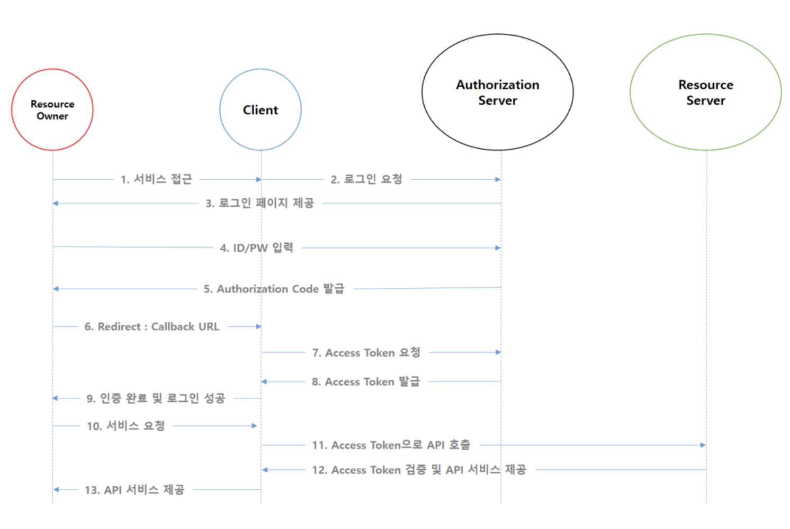

### OAuth2 과정
OAuth는 인터넷 사용자들이 비밀번호를 제공하지 않고 다른 웹사이트 상의 자신들의 정보에 대해 
웹사이트나 애플리케이션의 접근 권한을 부여할 수 있는 공통적인 수단으로서 사용되는, 접근 위임을 위한 개방형 표준이다

사용자가 서비스에게 접근 권한을 위임한다고 생각할 수 있다.

- 인증은 시스템 접근을 확인하는 것 (로그인) -> 인증만 하는 것은 [openID](https://coffeewhale.com/kubernetes/authentication/oidc/2020/05/04/auth03/)
- 권한은 행위의 권리를 검증하는 것

1. 사용자는 우리서비스에 oauth로 이용하기로 하고 접근을 하면 우리 서비스는 client id, clientSecret, redirect url을 함께 로그인 요청을 보낸다. 
2. Authorization sever는 로그인 페이지를 제공한다. (사용자 인증)
3. 사용자가 로그인을 하면 임시코드인 Authorization code(만료시간이 있음)를 우리서비스가 보낸 redirect uri 와 등록된 redirect url가 동일한지 확인하고 해당 url로 redirect 한다. 
4. 우리 서비스는 받은 코드를 이용해 AccessToken을 요청하고 발급받으면 **이제 서비스는 사용자에게 접근권한을 위임받은 것이다.** (Authorization code로 client 인증)

### OAuth 취약점
피싱사이트를 이용해 여러개 연동을 할 수 있는 서비스에 공격자의 계정을 등록할 수 있다.
Authorization 값을 공격자의 값으로 바꿔치키 한다면 피해자가 가입한 계정은 공격자의 계정으로 가입이 될 것이다.
[참고](https://aboutsc.tistory.com/200?category=671894)

- 해결법
state 파라미터를 사용한다. 인증요청시 추측할 수 없는 파라미터를 보내 인증과정에서 사용.

### Security 측
- OAuth2AuthorizationRequestRedirectFilter 가 있는데 "/oauth/authentication/kakao" 이라는 url로 요청이 오면
client id, clientSecret, redirect url을 함께 로그인 요청을 보낸다.code를 authorizationEndpoint인 ("/login/oauth/code/kakao")로 지정된 redirect url을 보내면
해당 필터인 OAuth2LoginAuthenticationFilter가 동작을 한다. 그렇게 온 요청에 대해 Authentication을 하고 저장한다.
완료되면 Authentication을 하고 아니면 익명이 되어 다시 Authentication하기위해 entrypoint로 보내진다. 

### 왜 JWT 인가?
Session을 사용하면 서버 확장시 세션정보의 동기화 문제가 있습니다. 초반에 무중단 배포를 하고자 했기에 동시성문제를 해결하는데 비용이 크다고 생각했ㄷ.
또 세션은 서버에 저장하던가 DB에 저장하기 때문에 오버헤드가 생긴다고 생각했습니다. Restapi는 무상태성을 지향한다.
그렇기 떄문에 JWT의 stateless한 성격과 self-contained한 성질을 갖고 있고
서버 자체에서 토큰인증을 하기 때문에 두 단점을 보완 할수 있다고 생각했다.

jwt의 단점으로는 담으려는 data가 많아지면 토큰길이가 길어저 네트워크에 부하를 줄 수 있다는 것이고
무상태성이기때문에 한번 만들면 서버에서 제어가 불가능하다.

현재 토큰에 담는 데이터는 그리 크지 않기 떄문에 문제가 되지 않았고 expiretime을 걸어주었다.

### 왜 Nginx?
우선 apache와 nginx 에 있어서 고민을 하였습니다. apache는 MPM(multi process module)이다.
Apache는 MPM아키텍처를 기반으로 클라이언트 요청을 처리하는 하고 있다..
MPM은 3가지 아키텍처를 근간으로 하고있다. 그렇기 때문에 프로세스 중심의 접근법이고 각 요청에대해 새로운 쓰레드가 필요하기 때문에
많은 요청이 대규모로 있다면 성능 측면에서 많은 이슈가 생길 수 있다.

Nginx는 프로세스 또는 쓰레드라는 개념을 사용하지 않고 이벤트 개념으로 접근한다.
단일 Nginx Worker가 동시에 수천개의 요청을 처리할 수 있다는 의미이다. Nginx의 Worker들이 이벤트가 트리거 될 때 마다 새로운 요청을 빠르게 선택할 수 있도록 
내부 시스템을 사용하는 방식이다. 이벤트 중심의 접근 방식이고 하나의 쓰레드에서 여러개의 요청을 처리한다.

nginx는 효율성에 중점을 두어 동시웹 요청에 대한 처리를 효율적으로 할 수 있다는 것이다. 단점으로는 동적컨텐츠를 처리하기가 복잡해 프로세스의 효율을 잡아 먹는다.
하지만 저희는 프론트를 apk로 다루기 떄문에 nginx에서 동적 컨텐츠를 다루지 않기 떄문에 아파치보다 nginx를 사용하는것이 훨씬 효울적이라고 생각했다. 

우리는 nginx 를 프록시 서버로 사용한ㄷ.

PreFork MPM (다중 프로세스)
- Client 요청에 대해 apache 자식 프로세스를 생성하여 처리.
- 요청이 많을 경우 Process 를 생성하여 처리합니다. 이 방식은 Apache 설치시 default 로 설정
- 하나의 자식프로세스당 하나의 스레드를 갖음 (최대 1024개)
- 스레드간 메모리 공유를 하지 않습니다. 이 방식은 독립적이기에 안정적인 반면, 메모리 소모가 크다는 단점이 있다

Worker MPM (멀티 프로세스-스레드)
- Prefork 보다 메모리 사용량이 적고 동시접속자가 많은 사이트에 적합합니다. 각 프로세스의 스레드를 생성해 처리하는 구조
- 스레드 간의 메모리 공유가 가능
- 프로세스 당 최대 64개의 스레드처리가 가능하며, 각 스레드는 하나의 연결만을 부여

Event-Driven 방식
 - 작업을 하다 I/O, socket read/write 등 CPU가 관여하지 않는 작업이 시작되면 기다리지 않고 바로 다른 작업을 수행

- [참고](https://youngmind.tistory.com/entry/Apache-vs-Nginx)
- [참고](https://webinstory.tistory.com/entry/Apache-vs-Nginx-비교)
### 왜 MongoDB?
RDB 는 정형화된 데이터를 다뤄 구조를 빠르게 확장해나갈 수 있는 장점인 DB인데
메시지와 같은 비정형데이터를 다루기엔 맞지 않다고 생각한다. 그래서 Nosql을 사용했다.
또 그 중 MongoDB를 사용한 가장 큰 이유는 다른 Nosql 보다 접근성이 쉬웠다. 문서화가 
스키마가 없을 뿐더러 스키마가 없으니 필요할 때마다 필드를 쉽게 변형시킬 수 있다. 또 범용 데이터베이스라 CRUD의 작접외에도 다양한 기능을 제공한다. 

이정도의 이유만으로 충분히 쓸 근거가 된다 생각한다.

### 왜 JPA?
우선 학습욕구가 컸다. DDD를 따르자는 의견이 있어 data JDBC를 가져가는게 맞지 않을까 생각했지만
JPA로 구현할 수 있을 거라 생각했다. 또 JPA는 ORM이다.
객체와 테이블을 맴핑하므로 데이터 지향적이지 않은 객체지향적인 코드를 작성할 수 있다고 생각했다.
메서드로서 다루기 힘든 복잡한 쿼리는 QueryDSL, JPQL로서 해결 가능하다 생각했다.

### 왜 MariaDB?
학습해야할 기술 스택들이 많았기 때문에 크루들 모두가 알고있어 쉽게 다가갈수 있는 Mysql과 고민을 했다. 그 중 가장 큰 이유는 일단 무료이다.
그리고 Mysql보다 빠르고 가볍다. Mysql과 높은 호환성을 갖는다. MySQL에서 MariaDB로 바꾼 사례가 있다고 한다. 

### 왜 Security?
'실제 운영해야 할 서비스이기 때문에 개인정보에 대한 보안에 신경 써야 하지 않을까?'라고 생각했고 보안 수준을 높일 방법이 뭐가 있을까 생각을 하였을 때
간단하지만 강력하게 구현 할 수 있는 이미 높은 보안 수준을 구축해둔 Spring Security를 사용하기로 선택했습니다.
Spring Security는 강력하면서도 쉽습니다. 게다가 단 몇십 줄의 코드만으로도 대형 웹서비스 사와 비슷한 수준의 보안을 유지할 수 있다는 장점이 있습니다.
Spring Security는 스프링 기반의 애플리케이션에서 보안을 위해 **인증**과 **권한 부여**를 사용하여 **접근을 제어**하는 프레임워크입니다. 또 커스터마이징이 가능하다.

<!--
### 어려웠던게 뭔지 해결하기위해 뭐했는지
프론트는 리액트 네이티브를 사용한 이유는 리엑트 네이티브 철학은 Learn once, write everywhere 입니다.
안드리오드 ios 모두 배포할 계획에 있어서 RN을 이용해 모든 플랫폼을 사용할 수있는 장점이 있어서 선택했습니다. 
expo cli를 이용하면 리액트 네이티브를 위한 set-up이 미리 구성되어있어서 네비게이션과 같은 기본적인 기능위주의 빠른 개발이 가능합니다.
고도화된 기능이 필요하지 않았기에 expo cli를 사용해 앱배포를 하였습니다.

## 멀티모듈의 중요성
-->
