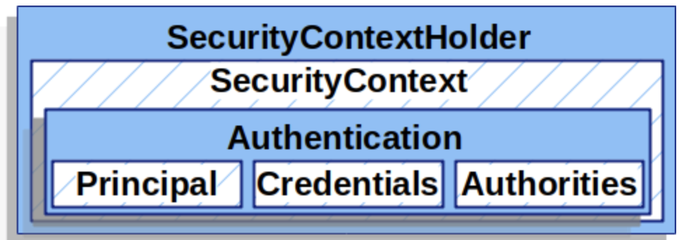
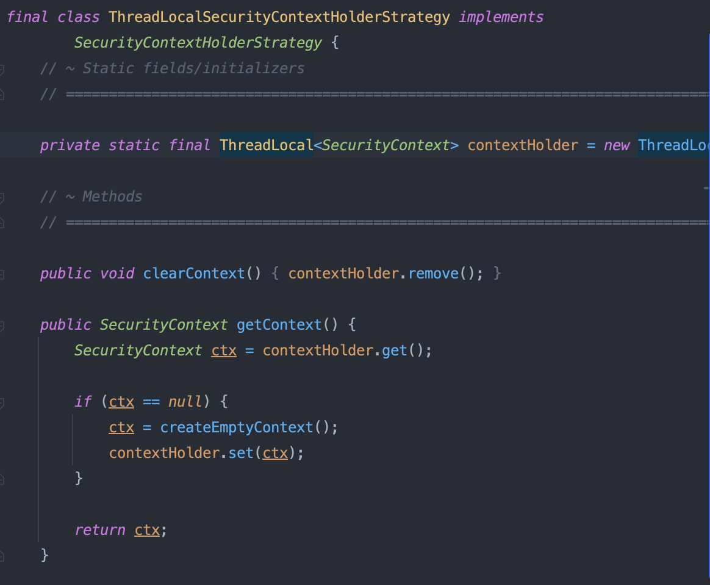
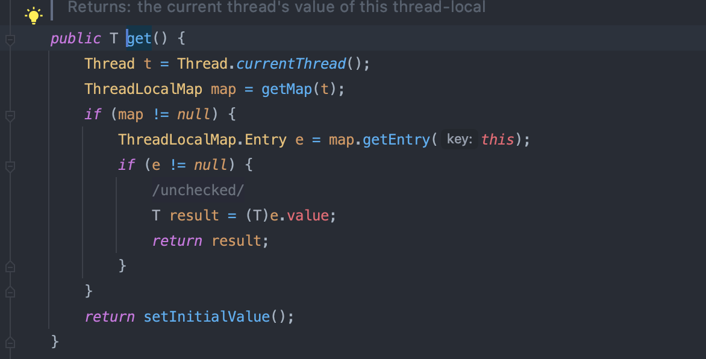

# 왜 Spring Securtiy 인가?
우선 시큐리티를 적용하기 전에 Form 형식의 회원가입을 통해 Member를 생성하였습니다.
하지만 '실제 운영해야 할 서비스이기 때문에 개인정보에 대한 보안에 신경 써야 하지 않을까?'라고 생각했고 보안 수준을 높일 방법이 뭐가 있을까 생각을 하였을 때
간단하지만 강력하게 구현 할 수 있는 이미 높은 보안 수준을 구축해둔 Spring Security를 사용하기로 선택했습니다.
Spring Security는 강력하면서도 쉽습니다. 게다가 단 몇십 줄의 코드만으로도 대형 웹서비스 사와 비슷한 수준의 보안을 유지할 수 있다는 장점이 있습니다.
Spring Security는 스프링 기반의 애플리케이션에서 보안을 위해 **인증**과 **권한 부여**를 사용하여 **접근을 제어**하는 프레임워크입니다. 또 커스터마이징이 가능합니다.

## Spring Security가 제공하는 기능들

다양한 기능들이 있습니다. 만약 Spring Security를 적용하지 않는다면 위의 기능들 중 필요한 부분을 모두 손수 다 구현해야 한다는 것입니다.

**그러니 안 쓸 이유가 없겠죠?**

또 Security에서 OAuth2를 Resource sever 로서 구현을 할 수도 있고 Client 로서 사용할 수 있도록 만들어 두었습니다.
Spring Security를 이용하지 않고 RestTemplate이나 WebClient로 OAuth를 제공하는 서비스에 API 요청을 쏘고 Redirect를 구현해 OAuth를 이용할 수 있지만
그 모든 게 Spring Security에 구현이 되어있기 때문에 Spring Security를 사용해 카카오 OAuth 서비스를 이용하였습니다.

하지만 이에 따른 대가가 있는데 너무 높은 추상화 수준 때문에 역추적이 쉽지가 않고 직접 디버깅을 하면서 따라가지 않으면 그 흐름을 파악하기 어렵다는 것입니다. 😭
그래서 먼저 기본적인 Spring Security [아키텍처](https://spring.io/guides/topicals/spring-security-architecture) 에 대해 알고 가야 한다고 생각하였고 학습 후 디버깅을 해보며 따라갔을 때 더 빠르게 흡수 할 수 있었습니다.

- 참고
    - [Spring Security 스프링 시큐리티](https://sieunlim.tistory.com/19)
    - [Spring Security Docs](https://docs.spring.io/spring-security/site/docs/5.1.5.RELEASE/reference/htmlsingle/#hello-web-security-java-configuration)

# Spring Security의 꼭 알아야할 내용
## 왜 알아야 할까?
**기본은 중요합니다.**

저는 OAuth를 적용하기 전에 먼저 Spring Security의 구동원리와 아키텍처에 대해 먼저 학습하였습니다.
처음에는 무턱대로 블로그의 글을 복붙하는 형식이였습니다. 코드를 그런식으로 긁어와 사용하니 그에 따른 부작용은 더욱 컸습니다. 여러 부작용들이 많았지만 가장 큰 두가지를 공유하겠습니다.

- 구현을 하는 사람이지만 OAuth 로그인 흐름을 파악하지 못했습니다.
- 우리 프로덕트 환경에서 필요없는 코드들이 생겨났고 그 값들이 DB에 저장되기 까지 했습니다.

이런 부작용을 없애기 위해서는 학습이 무조건 적으로 필요했습니다.

**먼저 Spring Security 를 알기 전에 미리 알아가고 들어가야할 개념 몇가지를 소개하겠습니다.**

## 용어
용어에 대해 먼저 알아보겠습니다. 그 나라의 언어를 모른다면 의사소통이 가능할까요? 시큐리티를 잘 이해하기 위해선 먼저 알고가야한다 생각합니다. 
- 접근 주체(Principal): 보호된 대상에 접근하는 유저
- 인증(Authenticate): 요청을 보낸 유저가 누구인지 확인(ex. 로그인), 애플리케이션의 작업을 수행할 수 있는 주체임을 증명
- 인가(Authorization): 현재 유저가 어떤 서비스, 페이지에 접근할 수 있는 권한을 부여
    - 권한: 인증된 주체가 애플리케이션의 동작을 수행할 수 있는 권한
        - 먼저 인증 과정을 통해 주체가 증명 된 이후 권한을 부여할 수 있음
        - 권한 부여에도 두 가지 영역이 존재하는데 웹 요청 권한, 메소드 호출 및 도메인 인스턴스에 대한 접근 권한 부여가 있음
    +)인증과 권한을 구분해 생각하는 것이 스프링 시큐리티를 이해하는데 가장 중요합니다.
- 증명서(Credential) : 인증 과정 중, 주체가 본인을 인증하기 위해 서버에 제공하는 것. (ID, Password 같은 것)
- 권한(authorities) : 유저에게 주어지는 권한입니다. 예를들어 roles, scopes  

## SecurityContextHolder

레퍼런스에 보면 SecurityContextHolder 를 다음과 같이 표현합니다.
 
>At the heart of Spring Security’s authentication model is the SecurityContextHolder

Spring security 의 핵심이라고 할 수있는데요. Spring security 는 SecurityContextHolder를 이용해 인증객체를 관리합니다.
SecurityContextHolder는 인증된 user의 details 를 저장하고 있습니다. details 에는 어떤 Authentication 객체를 쓰느냐에 따라 달라지는데
FormLogin을 사용할 경우 UserDetails 에 대한 내용이 OAuth2Login을 사용할 경우 OAuth2User 에 대한 내용이 저장됩니다.
우리 프로덕트에는 OAuth2 를 사용하니 OAuth2User 애 대한 내용이 들어가겠죠?

> The SecurityContextHolder is where Spring Security stores the details of who is authenticated. Spring Security does not care how the SecurityContextHolder is populated. If it contains a value, then it is used as the currently authenticated user.
>
> The simplest way to indicate a user is authenticated is to set the SecurityContextHolder directly.

SecurityContextHolder는 어떻게 저장되는지 방식에는 관심이 없다고 합니다. 즉, SecurityContextHolder 에 인증객체가 있다면
그 객체는 인증된 객체라고 생각하는 것입니다. 그냥 Security FilterChain에 Authentication 하는 Filter가 있습니다.
그 과정을 거치지 않아도 직접 SecurityContextHolder 에 set으로 넣어준다면 그 객체는 인증된 객체라고 생각하는 것입니다.

이 부분을 이용해서 JwtAuthenticationFilter 를 만들 것입니다.

SecurityContextHolder를 set 하기 위해서 다음과 같은 과정을 거칩니다.

```java
SecurityContext context = SecurityContextHolder.createEmptyContext();  // (1) 
Authentication authentication =
    new TestingAuthenticationToken("username", "password", "ROLE_USER"); // (2) 
context.setAuthentication(authentication);

SecurityContextHolder.setContext(context);
```

SecurityContext는 SecurityContextHolder로 부터 얻을 수 있습니다. SecurityContext는 Authentication 객체를 갖고 있습니다.

1. 비어있는 SecurityContext 만듭니다. 위의 과정을 **SecurityContextHolder.getContext().setAuthentication(authentication)** 로 한 번에 선언하는 걸 피하라고 나와 있습니다.
저렇게 선언한다면 멀티스레드일 경우 경합상태(race Condition) 이 발생할 수 있다고 합니다.
2. 그 후 Authentication을 선언해 저장합니다. **Authentication은 인터페이스입니다.**
Spring Security는 어떤 종류의 Authentication인지는 관심이 없습니다. Authentication을 구현한 구현체이기만 하면 됩니다.

Spring Security는 SecurityContextHolder 에 저장된 내용을 인가(Authorization)를 위해 사용합니다.

- [Spring Security Docs](https://docs.spring.io/spring-security/site/docs/current/reference/html5/#servlet-authentication-securitycontextholder)

## ThreadLocal
SecurityContextHolder를 이해하는 데 꼭 필요하다고 생각합니다. SecurityContextHolder는 전략적으로 어떻게 사용할 것인지 정해집니다.
디폴드 값은 ThreadLocal 로 사용됩니다. ThreadLocal 이란 간단히 설명해서 스레드 지역 변수입니다. 같은 Thread 하는 Scope 내에서 공유되어 사용될 수 있는 값으로 **다른 스레드**에서
공유변수에 접근할 시 발생할 수 있는 **동시성 문제의 예방**을 위해 만들어졌습니다. Security의 ThreadLocalSecurityContextH 클래스를 보면
ThreadLocal을 static으로 선언합니다. 그 이유를 생각해 본다면 이런 이유이지 않을까 생각됩니다.
Thread는 ThreadLocal을 Map으로 관리하고 있어서 여러 개의 ThreadLocal 값을 가지고 있을 수 있습니다.

static으로 선언하면 해시값이 항상 같기 때문에 하나의 ThreadLocal을 계속 쓸 수 있어 인증객체를 set 한 후 계속해서 이용할 수 있는 것입니다.
만약 static을 선언하지 않는다면 getContext 를 선언할 때마다 계속 TheadLocal을 생성해서 다른 메서드에서 SecurityContext를 사용할때 올바르지 못한 데이터를 참조할 것입니다.

아래 ThreadLocalSecurityContextH 클래스를 확인해 보면 알 수 있습니다.

- ThreadLocalSecurityContextHolderStrategy

- ThreadLocal 


또 Spring Docs에 보면 이런 말이 있습니다.
> Using a ThreadLocal in this way is quite safe if care is taken to clear the thread after the present principal’s request is processed. Spring Security’s FilterChainProxy ensures that the SecurityContext is always cleared.

요청이 끝나면 스레드를 비워버린다는 내용인데 이 부분도 ThreadLocalSecurityContextHolderStrategy 를 보면 알 수 있습니다.
Context를 get을 하는데 만약 스레드가 비어있지 않는다면 쓰레드가 재사용될때 쓰레드가 올바르지 않은 데이터를 참조할 수 있습니다.

따라서 다른 인증요청이 와도 이미 TheadLocal에 이전에 사용된 인증객체가 있어서 새로운 인증 요청이 와도 인증된 사용자라고 인증 허가를 내줄 것입니다.

## 헷갈렸던 부분
- SecurityContextHolder 와 Session
    - SecurityContextHolder 는 Spring Security의 인메모리 세션저장소 입니다.
    시큐리티의 설정중에 인증과정시 Session을 끄는 설정이 있습니다.
        ```java
        sessionManagement().sessionCreationPolicy(SessionCreationPolicy.STATELESS)
        ```
        [JWT](https://velopert.com/2350) 를 사용하기 때문에 Session을 사용할 필요가 없어서 해당 설정해주었는데
         디버깅에서 SecurityContextHolder 로 계속 인증객체를 저장하고 사용하는 것입니다.
        
         여기서 제가 헷갈린 거는 **세션**이란 단어를 혼동하고 있었던 것입니다. 저는 세션이라 함은 HttpSession 을 말하는 줄 알았거든요.
         그래서 SecurityContextHolder 인 인메모리 **세션**을 계속 사용하는 것이 너무 이상했습니다.
         지금 생각하면 정말 바보 같은 생각이죠
        
         부끄럽지만, 저와 같은 생각을 하는 사람이 있을 수 있기에.. 기록에 남깁니다.
        
         좀 자세히 들어가 보자면 우리가 흔히 웹 환경에서 쓰는 Session은 HttpSession을 이야기합니다.
         톰캣을 예로 들면 톰캣에서 활용할 수 있는 객체 범위의 종류(application, session, request, page) 중 하나인 session이라고 할 수 있습니다.
         Spring Security에서는 톰캣의 객체 범위(scope) 중 하나인 session을 사용하는 것이 아니라
         Threadlocal이라는 객체 범위(scope)를 활용합니다.
        
         **Session이라는 개념이 잘 안 잡혔기 때문에 나온 문제이죠.**
        
         [Session](https://ko.wikipedia.org/wiki/세션_(컴퓨터_과학)) 이란 **두 개 또는 그 이상의 의사소통하는 장치들(devices) 또는 컴퓨터 그리고 유저 간에 대화, 회화 또는 회의와 같은 반영구적인 쌍방향 정보 교환입니다.**
         Session은 정보교환이라는 의미를 나타내는 것이지 HttpSession이라는 특정한 것을 나타내는 게 아니라는 겁니다.
        
         이 차이를 알게 되니 확실히 이해되더라고요. 해당 내용을 잘 인지하고 들어가면 더 빠른 이해를 할 수 있을 것입니다.
         
         Security 가 왜 HttpSession을 사용하지 않고 ThreadLocal 을 사용했는지에 대해 몇가지 이유가 있습니다.
         1. HttpSession은 서블릿을 의존적하고 있습니다. Security는 기본적으로 서블릿 필터를 이용해 서블릿 보안을 기본으로하지만 서블릿 어플리케이션이 아닌 
         자바 어플리케이션에도 사용할 수 있도록 만들어졌습니다.
         2. HttpSession에 저장하지 않고 외부로 인증정보를 저장하는 형태로 구현이 가능합니다.(기본 클래스를 확장하여 DB 또는 Redis,MongoDB 등으로 인증 정보를 저장할 수 있습니다.)
         3. AOP 및 인터셉터 등 공동프레임 워크를 만들 시 유용합니다.
         
         2,3에 대한 이유는 아직 확실하게 와닿지 않지만 1의 이유만으로 이해하기에는 충분하다고 봅니다!
         
         
- 참고
    - [ThreadLocal이란1](https://devonce.tistory.com/25)
    - [ThreadLocal이란2](https://velog.io/@cbbatte/Spring-Security-아키텍처-1)
    - [SecurityContextHolder를 static으로 사용하는데 어떻게 필터에서 필요한 SecurityContext를 찾을 수 있을까?](https://sungminhong.github.io/spring/security/#2-spring-security의-구조)
    - [웹 어플리케이션의 객체 범위](https://victorydntmd.tistory.com/155)
    - [session 이란](https://devhaks.github.io/2019/04/20/session-strategy/)
    - [ThreadLocal 을 사용하는 이유](https://brunch.co.kr/@sbcoba/11)