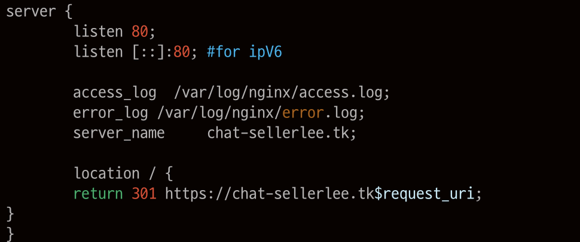
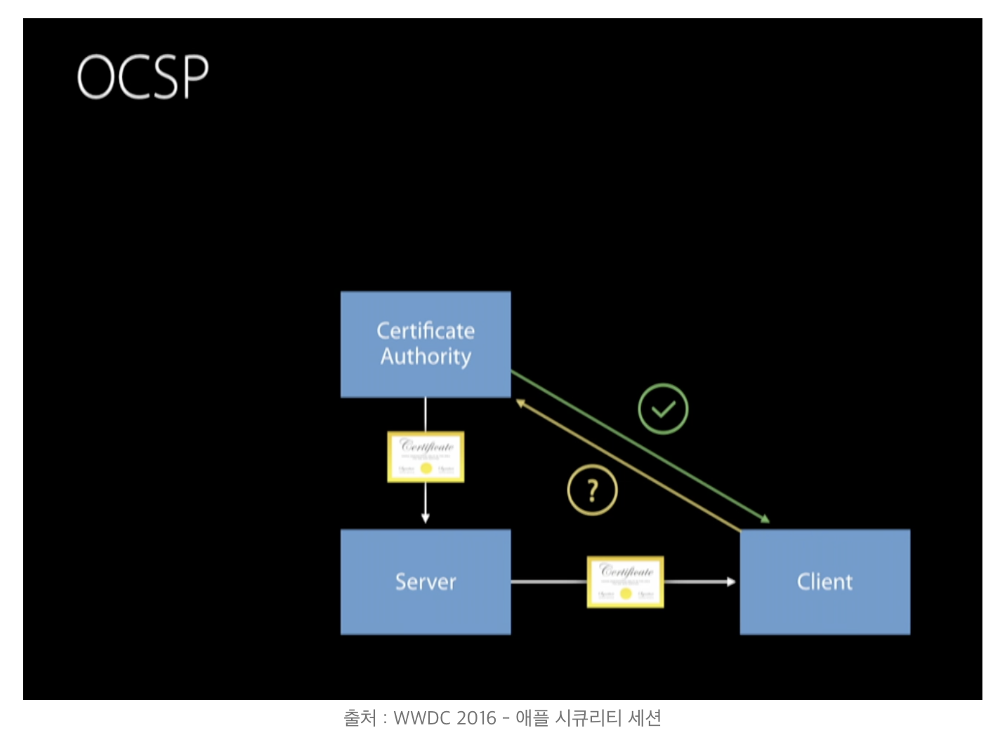
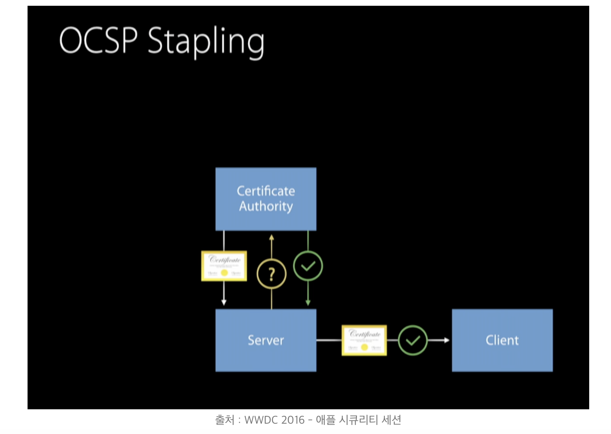
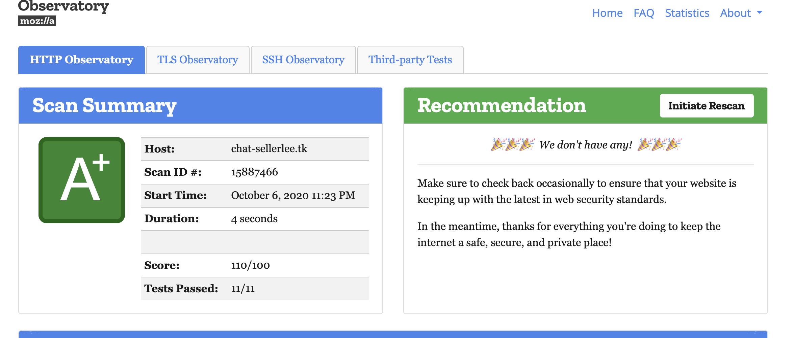

# Https
## OKKY를 통해 본 최신 기술 HTTP/3
- [참고](https://evan-moon.github.io/2019/10/08/what-is-http3/)

## Https vs Http
Http 는 웹서버와 사용자의 브라우저 사이에 문서를 전송하기 위한 프로토콜입니다. 이 프로토콜은 서버와 주고받은 정보가 암호화 되어있지 않다는 것입니다.
데이터를 쉽게 도난 당할 수 있습니다. 그래서 나온 것이 Http + SSL 이 합쳐진 프로토콜이다. SSL(보안 소켓 계층)을 사용함으로써 이 문제를 해결했다. 
또 Https는 보안에서만 이득을 보는것이 아니라 검색앤진 최적화에있어서도 이득을 본다.

## Https 통신과정
Http 는 통신하기 위해 3 way handshake를 한다. 그 후 Secure Socker Layer 의 통신 시작 단계에서 다시 HandShake 과정 거친다.

### 0. [Client ↔ Server] TCP 3-Way Handshake
SSL 먼저 TCP 위어서 동작하기 때문에 TCP 연결이 먼저 성립되어야 한다.

### 1.  [Client → Server] Client Hello
- 자신이 사용할 수 있는 Cipher Spec(암호화 방법) 목록 을 보낸다.
- Clinet Nonce(난수) 보낸다.
난수를 보내는 이유는 통신내용을 통째로 가져가 복사하는 행위를 막기위해서 이다.
새션식별자와 같은 정보들이 부가적으로 전송된다.

### 2.  [Server → Client] Server Hello
- Client 가 보낸 ClinetHello 패킷을 처리한 후 클라이언트가 보낸 Ciper Spec 중 하나를 선택한 후 Client 에게 알린다.
- Server Certificate(인증서 (공개키))
- Server Nonce
- CA 가 Certificate가 누구의 소유인지 보증하므로, 이과정에서 서버는 Client에게 자신을 인증할 수 있다. 즉, 
Client는 자신이 최초에 의도했던 Server와 통신하고 있음을 이 과정에서 확인할 수 있게 되는 것이다.


### 3.  [Client → Server] Client Key Exchange
- Encrypted Pre-master secret (PMS)

Client에서 일종의 난수 값인 Pre-master secret(PMS)(server와 통신할 대칭키로 활용할 값)를 생성하고, 이를 Server의 Publiuc Key로 암호화하여 Server로 전송합니다.

이후 Client와 Server는 {PMS, Client Nonce, Server Nonce} 이 세 값을 바탕으로 각각 Encryption Key와 MAC Key를 계산합니다. 

Encryption Key는 추후 사용될 암호화 통신에서 사용할 암호화 알고리즘에서 사용될 Key이고, 

MAC(Message Authentication Code) Key는 각 SSL Message Block에서 Message의 HMAC값 계산에 사용될 Key입니다.

참고적으로, SSL의 보안 통신에서 사용되는 Key는 대칭키입니다. 즉, Client 및 Server에서 각각 계산해서 생성한 Key들은 양측이 같은 값을 갖게 됩니다.

- 보안 통신을 위한 Key 생성이 완료되었으므로, 여기서부터 암호화된 보안 통신이 시작됩니다.

### 4. [Client ↔ Server] Handshake Integrity Check
그 동안 전송했던 모든 Message들에 대한 MAC값
이 단계부터 보안 통신이 가능하므로 본격적으로 Data를 교환할 수 있지만, 그 이전이 해야 할 일이 있습니다. 

바로 그간 Handshake과정에서 주고받았던 Message의 무결성(Integrity)를 검증하는 것입니다.

즉, 비록 SSL Handshake가 정상적으로 이루어졌지만, 중간에 혹시 있을지 모를 공격자가 Handshake Message를 변조했을 가능성이 존재합니다. 

예를 들어, Client가 지원 Cipher Spec 목록을 보낼 때 공격자가 이를 가로채서 높은 암호화 수준의 Spec을 제거한다거나, Server가 선택한 Spec을 낮은 암호화 수준의 Spec으로 변조하는 공격이 가능합니다. 

이는 PMS가 교환되기 이전까지의 통신은 모두 암호화가 되지 않은 상태로 이루어지기 때문에 발생하는 문제입니다.

따라서 암호화 통신이 가능해진 첫 시점에 Client와 Server는 각각 그 동안 자신이 전송했던 모든 Message들의 MAC값을 계산해서 상대측에게 전송합니다. 

상대방으로부터 받은 MAC값과 그 동안 자신이 받았던 Message들로부터 MAC값을 다시 계산한 값이 일치하는지 여부를 검사하여 Handshake Message들의 무결성을 체크할 수 있습니다.

이 Handshake과정의 무결성 체크까지 무사히 통과 하면 이제 비로소 본격적으로 보안 통신을 통한 Data 교환을 시작할 수 있게 됩니다


- 참고
    - [ssl handshake1](https://wayhome25.github.io/cs/2018/03/11/ssl-https/)
    - [ssl handshake2](https://www.tuwlab.com/ece/26967)

### 정리
0. http 위에서 동작하기 때문에 먼저 TCP 3way handshake를 수행한다.
1. 클라이언트는 서버에게 자신이 사용할 수 있는 암호화 목록과, client 난수를 보낸다.각종 sessionId 와 같은 부가정보를 보낸다.(통째로 복사해 사용하는 일을 방지하기 위해)
2. 서버는 클라이언트가 보낸 암호화목록중 가장 강력한 스펙을 골라 클라이언트에게 server 난수, 서버의 공개키가 담긴 인증서를 보낸다.
3. 대칭키로 사용될 Pre-master secret(PMA)를 생성하고 서버의 public key로 암호화 한다. 이후 서버와 클라이언트는 PMS와 난수값을 바탕으로
Encryption key(대칭키)와 Mac key를 계산한다.
4. handShake 과정에서 주고받았던 Message의 무결성을 검증한 후 암호화 통신이 가능하다.

### 대칭키와 비밀키
대칭키: 송신자 수신자가 같은 비밀키를 갖고 암호화 복호화를 함
비밀키: 송신자 수신작각 각자의 공개키/개인키를 갖고있다.

## SSL 설정

- nginx가 80 포트를 listen 하고 있다. 그럴경우 301 redirect로 https 로 요청한다.


- 해당요청을 보내면 proxy_pass 로 톰켓으로 요청을 보낸다.

### protocol
```
ssl_protocols TLSv1.1 TLSv1.2;
```
사용할 프로토콜을 나타냅니다. SSL 프로토콜은 너무 오래됐기때문에 이제 지원하지 않는다. 
그러나 보안을 더 고려한다면 TLSv1.0과 TLSv1.1 지원을 중단하는 것이 좋다고 한다. 이미 TLSv1.0은 시장에서 지원이 중단된 상태이기도 한다.

### oscp stapling
클라이언트가 인증서가 폐기된것인지 확인학기 위해 확인해야한다.
CRL ,OCSP ,OCSP Stapling 3가지 방식이 있는데 
- CRL은 페기 인증서를 다 받아와 확인하는 방법, 
- OCSP 은 client가 CA db에 접속해 확인하는 것

- OSCP Stapling 은 웹서버가 인증서가 유효하다는 증명을 미리 받아두어서 접속속도를 빨라지게함

그 중에 OCSP Stapling를 설정하는 것이다.
따라서 성능을 높일 수 있다.
```
ssl_stapling on;
ssl_stapling_verify on;
ssl_trusted_certificate /etc/letsencrypt/live/chat-sellerlee.tk/chain.pem;  #인증서 발급자
```
- 참고
    - [oscp stapling3](https://www.digicert.com/kb/enabling-ocsp-stapling.htm)
    - [oscp stapling1](https://rsec.kr/?p=386)
    - [oscp stapling2](https://ondemand.tistory.com/231)

### ssl session
ssl handshake가 되고나서 session을 적용시켜 계속 ssl 을 유지시켜준다.
session_tickets 을 사용하지 않으면 session Id를 이용하는데 session Id 디비에 저장되어야하고 메모리를 잡아먹을 수있다

분산환경에 경우 어려움이 있지만 ticket은 L4에 영향을 받지 않는다.
```
ssl_session_cache shared:SSL:10m; # a cache shared between all worker processes. 
ssl_session_timeout 10m;
ssl_session_tickets on;
```
- 참고
     - [session ticket]http://withbundo.blogspot.com/2018/01/https-ssl-session-id-session-ticket.html

### dhparam
키 교환 알고리즘에 사용될 dhparam 알고리즘이다. openSSL을 이용해 해당 폴더로 다운로드 하였다.

일반적으로 SSL/TLS만 적용해도 되지만 보안을 더욱 강화하기 위해서 보안키 수준을 높인다.

nginx는 openssl에서 제공하는 기본 DHE (Ephemeral Diffie-Hellman)를 사용합니다.

이는 1024비트에 기반한다. 그래서 nginx 자체가 아닌 사용자가 더 높은 보안을 담보하는 키를 생성해 줍니다.

ssl_ecdh_curve 는 dhparam에 사용될 타원곡선을 구체화 한다.

```
ssl_ecdh_curve auto;
ssl_dhparam /etc/letsencrypt/dhparam.pem;
```

## header

### X-Frame-Options
클릭재킹 방어를 위해 사용합니다. 클릭재킹이란 공격자가 원하는 것을 클릭하도록 속이는 해킹기법이다.

```
X-Frame-Options: sameorigin always;
```
option
- deny: 모든 프레임을 무효화
- sameorigin: 도메인 기준으로 같은 origin(서버) 에서는 렌더링을 허용
- allow-from https://example.com/은 불러올 수 있는 주소를 설정

### X-Content-Type-Options
잘못된 MINE타입이 포함된 응답이 있으면 거부하는 옵션이다.
```
add_header X-Content-Type-Options nosniff;
``` 

### X-XSS-Protection
XSS를 통한 세션 하이제킹을 막도록하는 명령으로 아래 네가지 옵션이 있다.
```
add_header "X-XSS-Protection" "1; mode=block";
``` 
크로스사이트스크립트를 탐지하면 웹 페이지를 사용자에게 아예 보여주지도 말라는 의미이다.


- X-XSS-Protection: 0
    - XSS 필터링을 비활성화
- X-XSS-Protection: 1
    - 크로스사이트스크립트 공격만 차단하고 웹페이지는 정상적으로 출력
- X-XSS-Protection: 1; mode=block
    - 크로스사이트스크립트를 탐지하면 웹 페이지를 사용자에게 아예 보여주지도 말라는 의미 
- X-XSS-Protection: 1; report=<reporting-uri>
    - 크로스사이트스크립트를 탐지하면 페이지 렌더링을 차단하고 위반 사항을 보고 
    
        이것은 CSP report-uri 지시문의 기능을 사용하여 보고서를 보냄

### Strict-Transport-Security
Https만을 사용하여 통신해야 한다고 브라우저에 알리는 보안기능
```
add_header Strict-Transport-Security "max-age=63072000" always;
```
max-age 만큼 Https로 접근해야한다고 기억됨

### Content-Security-Policy
CSP (Content Security Policy)는  XSS나 Data Injection, Click Jacking, 등
웹 페이지에 악성 스크립트를 삽입하는 공격기법들을 막기 위해 사용된다.

```
add_header Content-Security-Policy "default-src 'self'; ";
```
모든 컨텐츠의 소스는 자기 도메인에서 갖고 오게 된다. 서브도메인은 제외다. 라는 의미

- 참고
    - [CSP](https://content-security-policy.com/#source_list) 
### Referrer-Policy
Referrer 란 이전방문 페이지를 말한다. 해당 정책은 referrer 정보를 어떻게 컨트롤할건지 정하는 것이다.

```gherkin
Referrer-Policy: no-referrer
Referrer-Policy: no-referrer-when-downgrade
Referrer-Policy: origin
Referrer-Policy: origin-when-cross-origin
Referrer-Policy: same-origin
Referrer-Policy: strict-origin
Referrer-Policy: strict-origin-when-cross-origin
Referrer-Policy: unsafe-url
```

```
add_header Referrer-Policy "strict-origin-when-cross-origin";
```
- 같은홈페이지는 전체주소 다른 https갈때는 도메인주소만, http로 갈때는 제거이다.

- 참고
    - [referrer 정책](https://hi098123.tistory.com/152)
### Permissions-Policy
- 브라우저의 기능을 사용할지 결정하는 것이다. 

### 결과


- 참고
    - [nginx docs](http://nginx.org/en/docs/)
